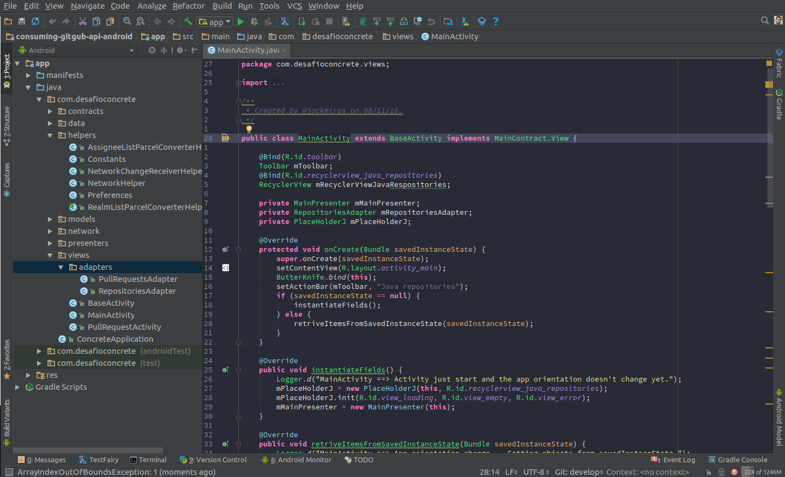

# Android Studio - Configs
This are the configurations that I've been using on my daily work. 
If you decide to use this Android Studio settings you should know that some 
preference settings has been turned on. I also use a different color theme and 
over the time I started to use some plugins so, take a look in the preview 
image and in the list down below to checkout what settings has been changed.

## Preview



## Installation
To install this configurations in your Android Studio you need to
download/clone this project them access the project directory and run the
install-config.sh scrip with the command shown down bellow.

```bash
	# Let's suppose that you have downloaded/cloned the project to your 'Download' folder.
	cd ~/Download/android-studio-config
	# Then give the execution permission to the install-config.sh.
	sudo chmod +x install-config.sh
	# Finally execute.
	sh install-config.sh
```

## Settings enabled

### Appearance & Behavior > Appearance
* Theme: Darcula
* Show memory indicator
* Disable mnemonics in menu

### Appearance & Behavior > System Settings
* Save files automatically if application is idle for 15 sec.

### Editor > General > Auto import
* Inser imports on past - 'All'
* Optimize imports on the fly
* Add unambiguous imports on the fly

### Editor > General > Appearance
* Use block caret
* Show line numbers
* Show white spaces
* Show CSS color preview as background

### Editor > General > Code Completion
* Insert selected variant by typing dot, space, etc.
* Show full signatures

### Editor > General > Code Folding
* Multiline comments
* Lambdas

### Editor > General > Smart Keys
* Use "CamelHumps" words
* Surround selection on typing quote or brace
* Add quotes for attribute value on typing '='

### Code Style > Java > Code Generation
* Field > Name prefix
	* Insert the 'm' value in the field.
* Static field > Name prefix
	* Insert the 's' value in the field.

### Inspections > Java
* J2ME Issues.

## Color scheme
* Dracula. [[link]](https://draculatheme.com/jetbrains/)

## Plugins
* Kotlin. [[link]](https://plugins.jetbrains.com/plugin/6954?pr=idea)
* IdeaVim. [[link]](https://github.com/JetBrains/ideavim)
* Relative Line Numbers. [[link]](https://plugins.jetbrains.com/plugin/7414?pr=idea)
* Markdown Navigator. [[link]](http://vladsch.com/product/markdown-navigator)
* .ignore. [[link]](https://github.com/hsz/idea-gitignore)
* TestFairy Integration. [[link]](https://docs.testfairy.com/Android/Uploading_with_Android_Studio.html)
* Android Studio Prettify. [[link]](https://github.com/Haehnchen/idea-android-studio-plugin)
* Android ButterKnife Zelezny. [[link]](https://github.com/avast/android-butterknife-zelezny)
* RoboPOJOGenerator. [[link]](https://github.com/robohorse/RoboPOJOGenerator)
* Android Parcelable code generator. [[link]](https://github.com/mcharmas/android-parcelable-intellij-plugin)
* Android Parcelable code generator(for Kotlin). [[link]](https://github.com/nekocode/android-parcelable-intellij-plugin-kotlin)
* Spek. [[link]](https://plugins.jetbrains.com/plugin/8564-spek)
* Genymotion. [[link]](https://plugins.jetbrains.com/plugin/7269-genymotion)
* SVG2VectorDrawable. [[link]](https://plugins.jetbrains.com/plugin/8103-svg2vectordrawable)
